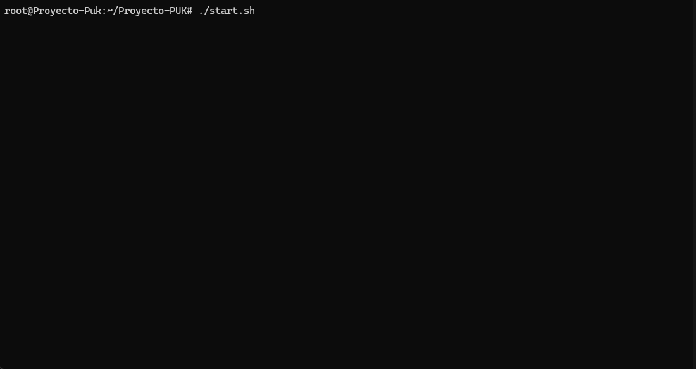
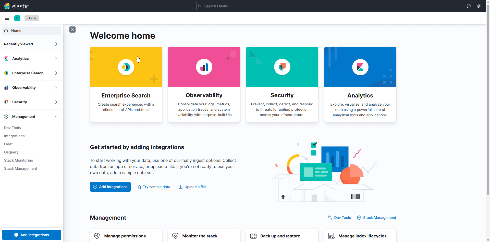
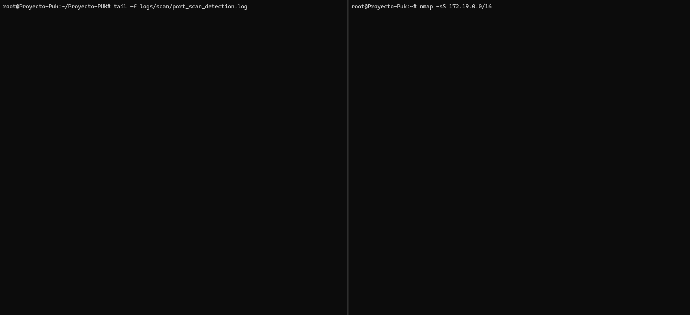

<p align="center">
  
</p>

<center>

# Implementación Segura de Docker en Ciberseguridad.
```
+---------------------+
|    Cliente Web      |
| (Acceso a Apache)   |
+----------+----------+
           |
           | HTTP/HTTPS
           v
+---------------------+     +----------------------+
|     Apache          |     |    OWASP CRS Rules   |
| (ModSecurity + WAF) +---->+ (Reglas de detección)|
+----------+----------+     +-----------+----------+
           |                            |
           | Logs de acceso/error       |
           v                            |
+---------------------+     +-----------v----------+
|    Fail2Ban         |     |   Puerto 5044        |
| (Bloqueo de IPs)    +<----+   Logstash           |
+----------+----------+     | (Procesamiento logs) |
           |              ^ +----------------------+
           |              |
           v              |
+---------------------+   |
| Detector de Escaneos|   |
| (Scapy + Python)    +---+
+----------+----------+
           |
           v
+---------------------+
|      ELK Stack      |
| (Elasticsearch,     |
|  Kibana, Filebeat)  |
+---------------------+
```


#### *Curso:* Ciberseguridad en Entornos de las Tecnologías de la Información.
</center>

- #### Cristian Manuel Hernández Cruellas	
- #### José Gael Hernández García	
- #### Jhamil Jesús Vargas Mariaca	
- #### Xabier Vega Castellà

---

## ÍNDICE

+ [Introducción](#id1)
+ [Justificación](#id2)
+ [Implementación](#id3)
+ [Posibles Mejoras Futuras](#id4)
+ [Conclusiones](#id5)
+ [Anexos](#id6)


+ [Bibliografía](#id7)

## *Introducción*. <a name="id1"></a>
Docker es una tecnología contenedor de aplicaciones construida sobre LXC que permite crear "contenedores", estas son aplicaciones empaquetadas auto-suficientes, muy livianas, capaces de funcionar en prácticamente cualquier ambiente, ya que tiene su propio sistema de archivos, librerías, terminal, etc.

## *Justificación*. <a name="id2"></a>

El objetivo es diseñar y desplegar un entorno seguro y monitorizable que permita simular, detectar y mitigar amenazas de seguridad en sistemas informáticos. Para lograrlo se pretende proteger los servicios desplegados y proporcionar visibilidad sobre posibles incidentes de seguridad, facilitando la detección temprana y la respuesta ante ataques. De este modo, se contribuye a mejorar la postura de seguridad y la capacidad de reacción frente a potenciales riesgos en la infraestructura tecnológica analizada.

En este caso, se trabaja con Docker y se implementan los servicios de Apache, ELK Stack, Fail2Ban y un sniffer de red.

Esta solución se ha elegido porque integra varias tecnologías y herramientas de referencia en la industria de la ciberseguridad, cada una cumpliendo un rol específico:

- **Apache:** Simula un servicio real expuesto a Internet.
```
├───apache
    │   └── Dockerfile
    ├───conf
    │     └── 000-default.conf
    ├───htpasswd
    │    └── .htpasswd
    └───www
         └── index.html
```


- **Fail2Ban:** Automatiza la detección y mitigación de ataques basados en patrones de logs y bloqueando IPs que realizan intentos como el acceso no autorizado alla web.

```
├───fail2ban
   │  └── Dockerfile
   │  └── jail.local
   └───filter.d
         └── apache-auth.conf
```


- **NIDS personalizado:** Es un sistema de detección de intrusiones en red desarrollado principalmente para identificar patrones de escaneo de puertos, como los que suelen generar herramientas de reconocimiento tipo Nmap.

```
└───scan_sniffer
       └─ Dockerfile
       └─ scan_script.py
       └─ requirements.txt
```

- **ELK Stack:** Nos proporcionará una estructura más visual de los logs en el sistema, con la ayuda de los dashboards configurados.

```
├───ell
   ├───filebeat
   │   └───config
   │          └───filebeat.yml
   └───logstash
          └───  Dockerfile
          └─── eventos.conf
```


## *Implementación*. <a name="id3"></a>

La principal herramienta que usamos es `docker` . Los servicios que se corren, depende de un sistema linux. Con la orquestación de contenedores, en este caso `docker-compose.yml`, se logra configurar todos los servicios para que trabajen al unísono, permitiendo crear redes virtuales, volúmenes persistentes como el caso de logs y algunas configuraciones comunes para que los contenedores puedan interactuar de manera segura y eficiente.

Cada servicio se construye a partir de su propio Dockerfile:

1. **Apache:** El Dockerfile instala Apache, ModSecurity y OWASP CRS, configura autenticación básica y copia la configuración personalizada y los archivos web estáticos. Ademas expone el puerto 8080.
- Apache
```bash
FROM ubuntu:24.04

ARG HTPASSWD_USER=admin
ARG HTPASSWD_PASS=admin

RUN apt-get update \
 && DEBIAN_FRONTEND=noninteractive apt-get install -y \
      apache2 \
      libapache2-mod-security2 \
      apache2-utils \
      git \
      wget \
      ca-certificates \
 && apt-get clean \
 && rm -rf /var/lib/apt/lists/*

```
- Modsecurity
```bash
Limpia cualquier CRS y clona OWASP CRS
RUN rm -rf /usr/share/modsecurity-crs /etc/modsecurity/crs \
 && git clone --depth 1 -b v4.14.0 \
      https://github.com/coreruleset/coreruleset.git \
      /etc/modsecurity/crs \
 && cp /etc/modsecurity/crs/crs-setup.conf.example /etc/modsecurity/crs/crs-setup.conf \
 && rm /etc/modsecurity/crs/crs-setup.conf.example
# Cambia SecRuleEngine a 'On' y copia el archivo final
RUN sed -i 's/^SecRuleEngine DetectionOnly/SecRuleEngine On/' /etc/modsecurity/modsecurity.conf-recommended 
```
- OWASP CSR
```bash
RUN printf '%s\n' \
    "Include /etc/modsecurity/crs/crs-setup.conf" \
    "IncludeOptional /etc/modsecurity/crs/rules/*.conf" \
  >> /etc/apache2/conf-available/security2.conf
```
- Autenticación
```bash
RUN a2enmod security2 auth_basic authn_file \
 && a2enconf security2

RUN mkdir -p /etc/apache2/.htpasswd
COPY htpasswd/.htpasswd /etc/apache2/.htpasswd/.htpasswd

COPY conf/000-default.conf /etc/apache2/sites-available/000-default.conf

RUN a2dissite 000-default || true \
 && a2ensite 000-default

RUN echo "ServerName localhost" >> /etc/apache2/apache2.conf

COPY www/ /var/www/html/

EXPOSE 80 443
CMD ["apachectl", "-D", "FOREGROUND"]
```
2. **Fail2Ban:** El contenedor se construye sobre Ubuntu, instala Fail2Ban y copia las reglas y filtros personalizados, permitiendo, almacenar alertas de ataques y bloquear ip basadas en los logs.

```bash
FROM ubuntu:22.04

RUN apt-get update && \
    apt-get install -y fail2ban iproute2 && \
    mkdir -p /etc/fail2ban/filter.d

CMD ["fail2ban-server", "-f", "-x"]
```

3. **IDS personalizado:** Utiliza una imagen con el servicio Python y la libreria Scapy que llama desde un archivo.txt para asi implementar un sniffer de red capaz de detectar escaneos de puertos en tiempo real, registrando alertas en un archivo de log compartido.

- Requirements.txt
```bash
scapy
```

- Dockerfile
```bash
FROM python:3.9-slim

RUN apt-get update && \
    apt-get install -y libpcap0.8 && \
    rm -rf /var/lib/apt/lists/*

RUN mkdir -p /logs

COPY requirements.txt .
RUN pip install --no-cache-dir -r requirements.txt

COPY ids_script.py .

ENTRYPOINT ["python", "ids_script.py"]
```

4. **ELK Stack:** Utiliza 4 servicios para funcionar: **elasticsearch**, **logstash**, **filebeat**, **kibana**. El funcionamiento es el siguiente primero filebeat reconoce los logs asosicados a este, en este caso los logs generados por apache2, fail2ban y el ids. Luego este lo comparte en logstash y lo parsea para que el kibana lo lea.

```bash 
FROM docker.elastic.co/logstash/logstash:7.17.28

COPY eventos.conf /usr/share/logstash/pipeline/logstash.conf
```

Finalmente podemos ver la estructura del proyecto podemos ver que está organizado para facilitar la gestión y configuración de cada servicio de manera aislada y modular.

```
.
├─── docker-compose.yml
│
├───apache
│   │   └───Dockerfile
│   ├───conf
│   │      └───000-default.conf
│   ├───htpasswd
│   │       └───.htpasswd
│   └───www
│         └───index.html
├───elk
│   │└───prueba_logstash.sh
│   ├───elasticsearh
│   │        └─── Dockerfile
│   │        └───jvm.options
│   ├───filebeat
│   │   └───config
│   │            └─── filebeat.yml
│   └───logstash
│            └─── Dockerfile
│            └─── eventos.conf
├───fail2ban
│   │   Dockerfile
│   │   jail.local
│   └───filter.d
│           apache-auth.conf
├───logs
│   ├───apache
│   │       access.log
│   │       error.log
│   ├───fail2ban
│   │       fail2ban.log
│   └───scan
│           scan_sniffer.log
└───scan_sniffer
        Dockerfile
        scan_script.py
        requirements.txt

```
#### ¿Qué conseguimos al configurarlo de esta manera?

Al configurar el entorno de esta manera, conseguimos un sistema eficiente y seguro, donde cada servicio opera de forma aislada en su propio contenedor, lo que minimiza riesgos y simplifica la gestión de dependencias. Además, se garantiza el poder desplegarse en cualquier máquina compatible con Docker. 

> **INFO:** Aunque a nivel avanzado actualmente no es compatible con windows(vlans,cap_add, ...).

## Inicialización de contenedores

Para la inicialización de  los servicios se hace uso de un script denominado `start.sh`.

```bash
chmod +x start.sh
./start.sh
```

Y su funcionamiento sería algo como esto:



## Importación de Dashboards e Index Patterns

Desde la página de inicio de nuetro elk. 

Primero descargaremos nuestro archivo con el contenido ubicado en elk/kibana como ilustramos a continuación.

```
                        +-------+
                        |  elk  |
                        +-------+
                            |
                        +--------+   +---------------+
                        | kibana |---| export.ndjson |
                        +--------+   +---------------+
```

Y para cargarlo en nuestro elk.


> **IMPORTANTE!:** En caso de que no funcione aún nuestra importación deberán esperar a que se asiente el sistema nuestros servicios.
## Comprobaciones de funcionamiento

### 1.Escaneo de puertos 
Podemos ver como nuestro servicio de escaneo responde contra los nmaps.



### 2.Acceso al Servidor Web
Servidor web funcionando.

<p align="center">
  
</p>


### 3. ELK
Dashboard de alertas


## *Posibles Mejoras Futuras*. <a name="id4"></a>

### 🪶 Servicio Apache
1. Se podria implementar certificado SSL/TLS, Configurar reglas en Apache para forzar conexiones seguras con el protocolo HTTPS y deshabilitar protocolos y algoritmos obsoletos como TLS 1.0
2. Tambien se podría usar la integración con LDAP/Active Directory para acceso restringido y automatizar la actualización de .htpasswd mediante scripts o herramientas externas.

### 🚫 Fail2Ban
1. Usar fail2ban-server con persistencia en SQLite o PostgreSQL para mantener los bloqueos tras reinicios.
2. También se pueden integrar con listas negras de IPs maliciosas.
3. Crear filtros adicionales para detectar patrones únicos, como pueden ser los generados por los logs del ids.

### 🐍 IDS
1. Complementar o Reemplazar por un sistema IDS/IPS cómo puede ser Suricata, snort o incluso Zeek.
2. Con esta implementación se podria extender a una análisis más alla de TCP/UDP como : ICMP, DNS inusuales,etc.

### 🌐 ELK stack
1. Definir los recursos que puede consumir esta.
2. limitar accesos asi habilitando seguridad en Elasticsearch/Kibana con usuarios y permisos.
3. Se podria implementar acciones de envío de alertas por email en jail.local
4. Añadir monitoreo de métricas del sistema como la CPU, memoria, red...

##  🐳 Mejoras generales Docker
1. Implementar un mecanismo de borrado periódico y automatizado de logs , para gestionar de forma eficiente el ciclo de vida de los datos almacenados en nuestro entorno ELK.
2. Administrar en un mayor almacenamiento la información de los servicios con el fin de garantizar la disponibilidad y retención prolongada de los datos.
3. Prevenir riesgos de seguridad implementando capas de protección como SSL/TLS para la comunicación encriptada, GPG para la autenticación y firma digital de logs, y buenas prácticas de hardening en todos los servicios involucrado.

## *Conclusiones*. <a name="id5"></a>
En cuanto a Apache se refiere, el proceso de construir esta imagen de manera manual ha resultado excesivamente engorroso: la constante lucha con dependencias incompatibles, directorios preexistentes que obstaculizan el despliegue y la persistencia de errores de caché convierten cada compilación en una tarea laboriosa; la escasa documentación y la necesidad de purgar manualmente rutas internas de ModSecurity antes de cada clonación transforman lo que debería ser una simple configuración en un procedimiento farragoso que consume un tiempo desproporcionado y genera una notable frustración.

Con el fail2ban, ...

Con el ids creado por python ,...

Finalmente, trabajando con ELK nos dimos cuenta de que, al principio, puede ser un poco desordenado manejar los logs porque no siempre están bien estructurados o comprimidos, lo que genera cierta confusión. Pero una vez que le encontramos el ritmo y organizamos bien la entrada y salida de datos, ELK se convierte en una herramienta muy útil para ver, gestionar y entender lo que pasa en nuestros sistemas.

## *Anexo*. <a name="id6"></a>

# Docker-compose

```bash
services:
  webserver:
    build: ./apache
    container_name: apache-secure
    volumes:
      - ./logs/apache/error.log:/var/log/apache2/error.log
      - ./logs/apache/access.log:/var/log/apache2/access.log 
    networks:
      - proyecto_monitoring_net
    ports:
      - "8080:80"
    dns:
      - 8.8.8.8
```

```bash
  fail2ban:
    build: ./fail2ban
    container_name: fail2ban
    volumes:
      - ./logs/apache/access.log:/var/log/apache2/access.log:ro
      - ./fail2ban/jail.local:/etc/fail2ban/jail.local:ro
      - ./fail2ban/filter.d:/etc/fail2ban/filter.d:ro
      - ./logs/fail2ban/fail2ban.log:/var/log/fail2ban.log 
    networks:
      - proyecto_monitoring_net
    cap_add:
      - NET_ADMIN
      - NET_RAW
    privileged: true
```

```bash
  port-scan-detector:
    build:
      context: ./nmap-detector
      dockerfile: Dockerfile
    container_name: nmap-detector
    networks:
      - proyecto_monitoring_net
    cap_add:
      - NET_RAW
      - NET_ADMIN
    volumes:
      - ./logs/scan:/logs
    environment:
      - THRESHOLD=15
      - TIME_WINDOW=60
```
```bash
  elasticsearch:
    image: docker.elastic.co/elasticsearch/elasticsearch:7.17.28
    container_name: elastic
    environment:
      - discovery.type=single-node
    ports:
      - 9200:9200
      - 9300:9300
    networks:
      - proyecto_monitoring_net

  logstash:
    build: ./elk/logstash
    container_name: logstash
    volumes:
      - ./elk/logstash/eventos.conf:/usr/share/logstash/pipeline/logstash.conf:ro
    environment:
      - ELASTICSEARCH_HOST=elasticsearch
      - "LOGSTASH_PIPELINE_PATH=/usr/share/logstash/pipeline/logstash.conf"
    depends_on:
      - elasticsearch
    ports:
      - "5044:5044"
    networks:
      - proyecto_monitoring_net
```
```bash
  kibana:
    image: docker.elastic.co/kibana/kibana:7.17.28
    container_name: kibana
    environment:
      - ELASTICSEARCH_HOSTS=http://elasticsearch:9200
      - SERVER_PUBLICBASEURL=http://localhost:5601
    ports:
      - 5601:5601
    networks:
      - proyecto_monitoring_net
```
```bash
  filebeat:
    image: docker.elastic.co/beats/filebeat:8.10.3
    container_name: filebeat
    volumes:
      - ./logs:/logs
      - ./elk/filebeat/config/filebeat.yml:/usr/share/filebeat/filebeat.yml:ro
    depends_on:
      - logstash
    networks:
      - proyecto_monitoring_net

```
```bash
networks:
  proyecto_monitoring_net:
    driver: bridge
```
#### filebeat.yml
```
filebeat.inputs:
  # LOGS de Fail2ban
- type: log
  enabled: true
  paths:
    - /logs/fail2ban/fail2ban.log
  fields:
    type: fail2ban

# Logs de apache
- type: log
  enabled: true
  paths:
    - /logs/apache/access.log
  fields:
    type: apache_access
# Logs de nmap
- type: log
  enabled: true
  paths:
    - /logs/scan/*.log
  fields:
    type: nmap

processors:
- add_host_metadata: ~

output.logstash:
  hosts: ["logstash:5044"]
```


# Servicios Dockerfile

## <a id="va1" href="https://github.com/Jhamil9/Proyecto-PUK/tree/e09914822d33f31c20c951bd1c2ee2b79de4f1ad/Docker/apache">Apache</a>

```bash
FROM ubuntu:24.04

# Usuraio y contraseña de acceso al servicio
ARG HTPASSWD_USER=admin
ARG HTPASSWD_PASS=admin


# 1) Instalación de Apache, ModSecurity, utils y apache2-utils
RUN apt-get update \
 && DEBIAN_FRONTEND=noninteractive apt-get install -y \
      apache2 \
      libapache2-mod-security2 \
      apache2-utils \
      git \
      wget \
      ca-certificates \
 && apt-get clean \
 && rm -rf /var/lib/apt/lists/*

# 2) Limpia cualquier archivo de CRS y clona OWASP CRS oficial
RUN rm -rf /usr/share/modsecurity-crs /etc/modsecurity/crs \
 && git clone --depth 1 -b v4.14.0 \
      https://github.com/coreruleset/coreruleset.git \
      /etc/modsecurity/crs \
 && cp /etc/modsecurity/crs/crs-setup.conf.example /etc/modsecurity/crs/crs-setup.conf \
 && rm /etc/modsecurity/crs/crs-setup.conf.example

# 3) Cambiar SecRuleEngine a 'On' y copia el archivo final
RUN sed -i 's/^SecRuleEngine DetectionOnly/SecRuleEngine On/' /etc/modsecurity/modsecurity.conf-recommended 

# 4) Prepara ModSecurity (cargar solo el setup + reglas)
RUN printf '%s\n' \
    "Include /etc/modsecurity/crs/crs-setup.conf" \
    "IncludeOptional /etc/modsecurity/crs/rules/*.conf" \
  >> /etc/apache2/conf-available/security2.conf

# 5) Habilitar los módulos necesarios
RUN a2enmod security2 auth_basic authn_file \
 && a2enconf security2

# 6) Copiar el .htpasswd (pre‑generado en htpasswd/.htpasswd)
RUN mkdir -p /etc/apache2/.htpasswd
COPY htpasswd/.htpasswd /etc/apache2/.htpasswd/.htpasswd

# 7) Copiar nuestro VirtualHost con la auth “in‑line” y los logs
COPY conf/000-default.conf /etc/apache2/sites-available/000-default.conf

# 8) Desactiva cualquier sitio por defecto y activa el que hemos copiado
RUN a2dissite 000-default || true \
 && a2ensite 000-default

# 9) Definir un ServerName para silenciar un posible warning
RUN echo "ServerName localhost" >> /etc/apache2/apache2.conf

# 10) Copia nuestra web estática
COPY www/ /var/www/html/

# 11 Abrir los puertos
EXPOSE 80 443
CMD ["apachectl", "-D", "FOREGROUND"]
```

## <a id="va1" href="https://github.com/Jhamil9/Proyecto-PUK/tree/e09914822d33f31c20c951bd1c2ee2b79de4f1ad/Docker/fail2ban">Fail2Ban</a>

```bash
FROM ubuntu:22.04
RUN apt-get update && \
    apt-get install -y fail2ban iproute2 && \
    mkdir -p /etc/fail2ban/filter.d
CMD ["fail2ban-server", "-f", "-x"]
```

## <a id="va1" href="https://github.com/Jhamil9/Proyecto-PUK/tree/e09914822d33f31c20c951bd1c2ee2b79de4f1ad/Docker/nmap-detector">IDS</a>

```bash
FROM python:3.9-slim
RUN apt-get update && \
    apt-get install -y libpcap0.8 && \
    rm -rf /var/lib/apt/lists/*
RUN mkdir -p /logs
COPY requirements.txt .
RUN pip install --no-cache-dir -r requirements.txt
COPY ids_script.py .
ENTRYPOINT ["python", "ids_script.py"]
```

## <a id="va1" href="https://github.com/Jhamil9/Proyecto-PUK/tree/e09914822d33f31c20c951bd1c2ee2b79de4f1ad/Docker/elk">ELK stack</a>

```bash
FROM docker.elastic.co/logstash/logstash:7.17.28

COPY eventos.conf /usr/share/logstash/pipeline/logstash.conf
```


## *Bibliografía*. <a name="id7"></a>

+  Documentación que se ha usado
   + [Docker](https://docs.docker.com)
   + [Dockerfile](https://stackoverflow.com/questions/tagged/dockerfile)
   + [Implementación de elasticsearch en docker](https://www.elastic.co/docs/deploy-manage/deploy/self-managed/install-elasticsearch-with-docker)
   + [Apache-modsecurity](https://github.com/coreruleset/modsecurity-crs-docker)
   + [Filebeat](https://www.elastic.co/beats/filebeat)
   + [Python](https://github.com/cptpugwash/Scapy-port-scanner/tree/master)

+ imagenes usadadas
   + [imagen ubuntu](https://hub.docker.com/_/ubuntu)
   + [Logstash](https://hub.docker.com/_/logstash)
   + [Kibana](https://hub.docker.com/_/kibana/)
   + [Python](https://hub.docker.com/_/python)
