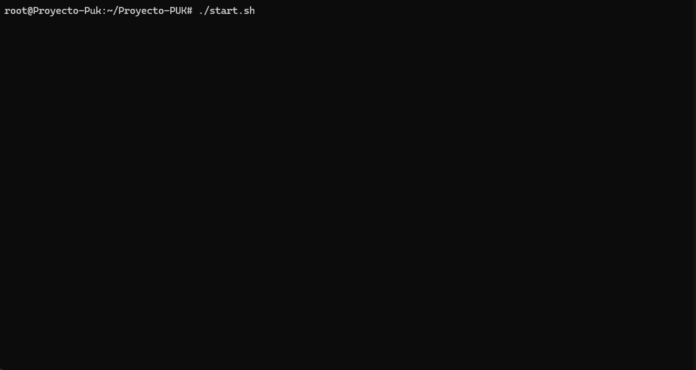

# Proyecto-PUK

## Inicialización de contenedores

Para la inicialización de  los servicios se hace uso de un script denominado `start.sh`.

```bash
chmod +x start.sh
./start.sh
```

Y su funcionamiento sería algo como esto:



## Importación de Dashboards e Index Patterns

Desde la página de inicio de nuetro elk. http://localhost:5601

Primero descargaremos nuestro archivo con el contenido ubicado en elk/kibana como ilustramos a continuación.

```
                        +-------+
                        |  elk  |
                        +-------+
                            |
                        +--------+   +---------------+
                        | kibana |---| export.ndjson |
                        +--------+   +---------------+
```

Y para cargarlo en nuestro elk.


> **IMPORTANTE!:** En caso de que no funcione aún nuestra importación deberán esperar a que se asiente el sistema nuestros servicios.
## Comprobaciones de funcionamiento

### 1.Escaneo de puertos 
Podemos ver como nuestro servicio de escaneo responde contra los nmaps.


### 2.Acceso al Servidor Web
Intentamos acceder al servicio web, sin exito.


### 3.Comprobación en el Dashboard

Y vemos que todo se esta registrando en nuestro Dashboard de forma más visual.


